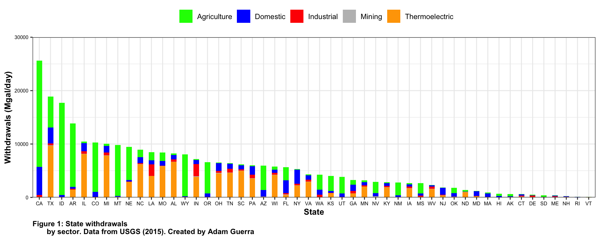
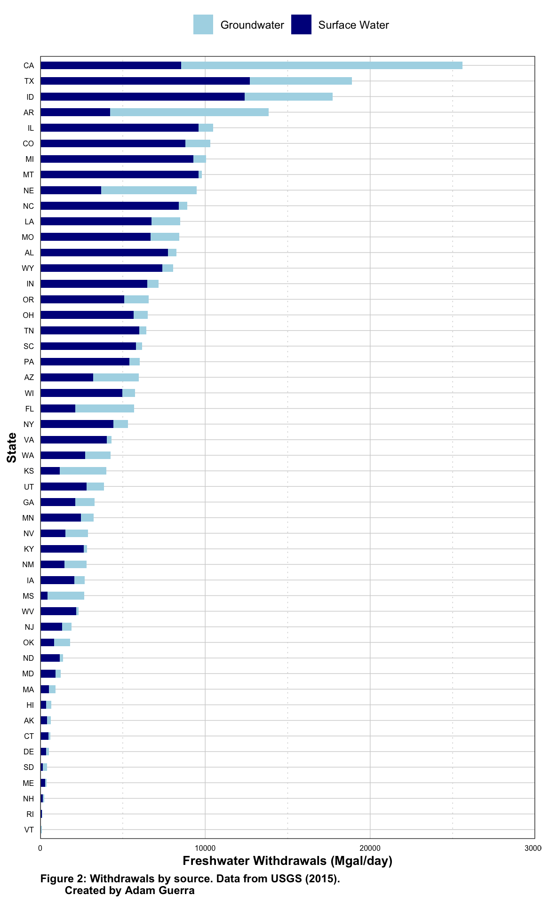
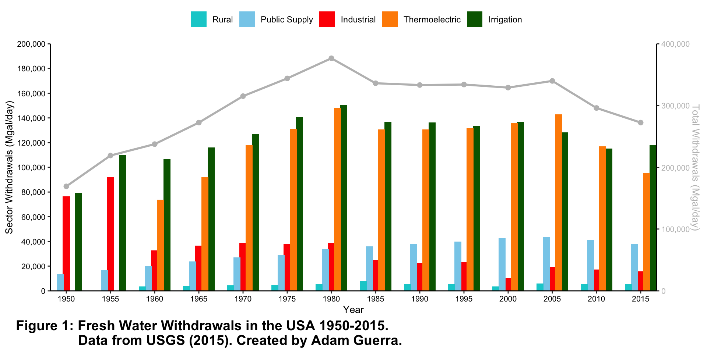
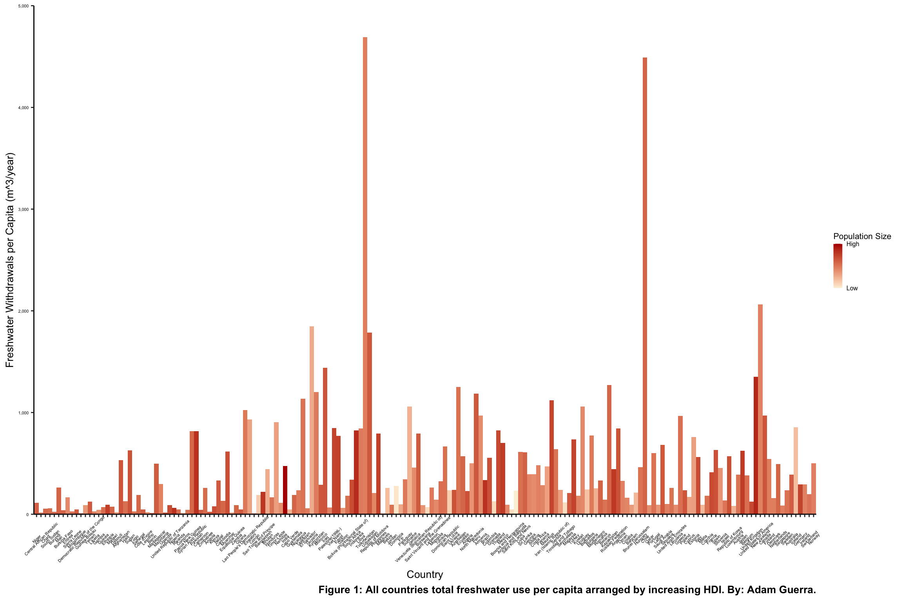
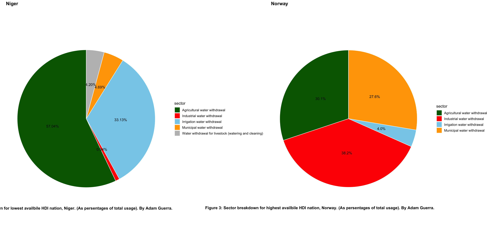

## Portfolio

---

## Water Data Analysis Projects

[Analyzing Freshwater usage in US States by Sector in 2015](/assets/Adam_Guerra_Lab_05.html)

Description: Imported data from USGS, cleaned and manipulated the data for plotting, created one figure to look at states sector breakdowns, and another figure to look at ground vs surface withdrawals.

 

---
[Creating a Timeseries of US Freshwater Usage from 1950 to 2015 by Sector](/assets/Adam_Guerra_lab_07.html)

Description:  Imported data from USGS, cleaned and manipulated data for plotting, created a time series of the manipulated data.

---
[Analyzing Freshwater Usage for All Nations in 2019 by HDI](/assets/Adam_Guerra_final_project.html)

Description: Imported Data from FAO AQUASTAT, cleaned and manipulated data for plotting, made one figure arranged by HDI of all nations with availible data, and made another figure comparing the lowest HDI nation to the highest HDI by sector.

 
